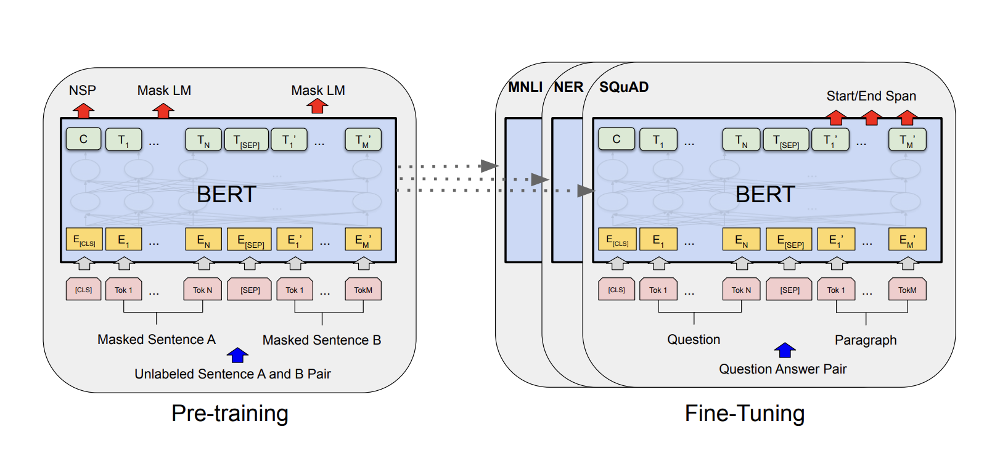

# Intent Classification with BERT

## Objective
The goal of this project is to train and fine-tune a pre-trained BERT model on a text classification task.

## Data
ATIS (Airline Travel Information Systems) Dataset: https://github.com/howl-anderson/ATIS_dataset

## Model
Pretrained bert-base-uncased: https://huggingface.co/google-bert/bert-base-uncased 

## Results
Achieved a weighted f1 score ~ 97.7%

## Device
1 NVIDIA GeForce GTX 1080 Ti

## Software and Libaries
- Python 3.9
- Scikit-learn
- Tensorflow
- Pytorch
- Jupyter Notebook

